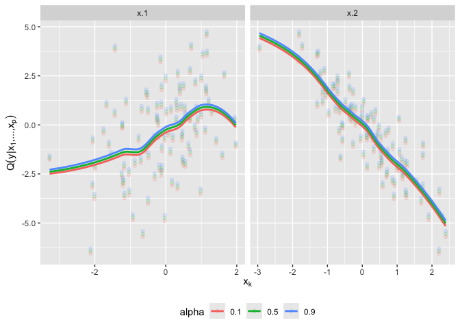

# C-vine regression

<!-- badges: start -->

[](https://CRAN.R-project.org/package=cvinereg)
[](https://github.com/jobstdavid/cvinereg/actions)
[](https://github.com/jobstdavid/cvinereg)

<!-- badges: end -->

An R package for C-vine copula based mean and quantile regression.

## Installation

You can install the development version from GitHub with:

``` r
# install.packages("remotes")
remotes::install_github("jobstdavid/cvinereg")
```

## Example

``` r
library(cvinereg)

# simulate data
set.seed(2024)
x <- matrix(rnorm(200), 100, 2)
y <- x %*% c(1, -2)
data <- data.frame(y = y, x = x)

# fit vine regression model
(fit <- cvinereg(y ~ ., data))
#> C-vine regression model: y | x.2, x.1 
#> nobs = 100, edf = 3, cll = 67.44, caic = -128.88, cbic = -121.07

# summary of fit
summary(fit)
#>   var edf       cll      caic      cbic      p_value
#> 1   y   0 -221.3855  442.7710  442.7710           NA
#> 2 x.2   1   79.0774 -156.1548 -153.5496 2.862975e-36
#> 3 x.1   2  209.7498 -415.4996 -410.2892 8.069092e-92

# show marginal effects for all selected variables
plot_effects(fit)
#> `geom_smooth()` using method = 'loess' and formula = 'y ~ x'
```



## Contact

Feel free to contact <jobstd@uni-hildesheim.de> if you have any
questions or suggestions.

## References

- Tepegjozova and Czado (2019), D- and C-vine quantile regression for
  large data sets, <https://mediatum.ub.tum.de/doc/1536070/1536070.pdf>.
- Tepegjozova et al. (2022). Nonparametric C- and D-vine-based quantile
  regression, Dependence Modeling, 10(1), 1-21,
  <https://doi.org/10.1515/demo-2022-0100>.
